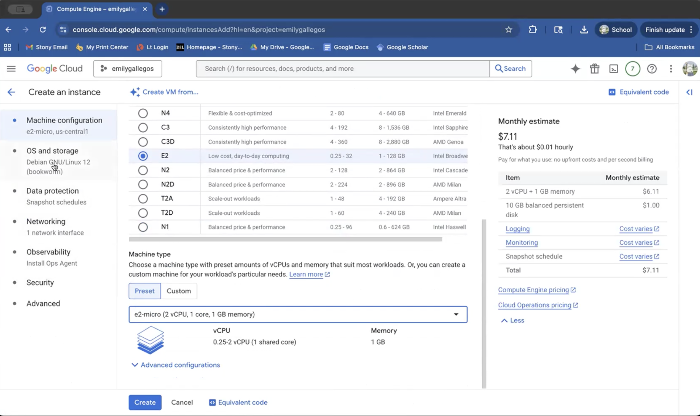
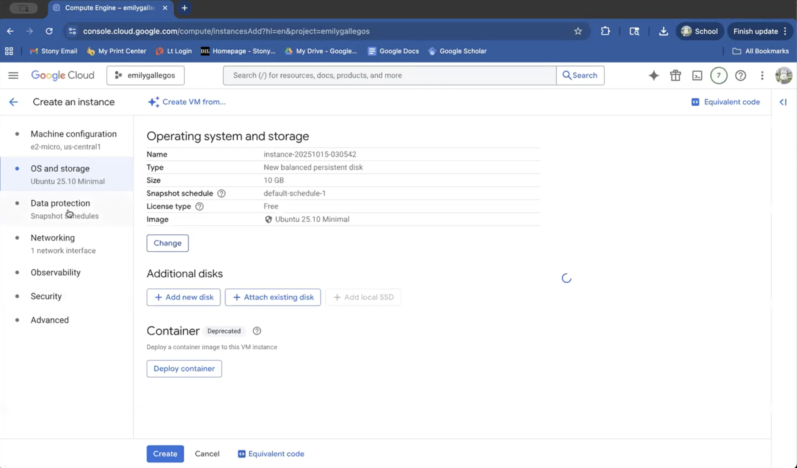
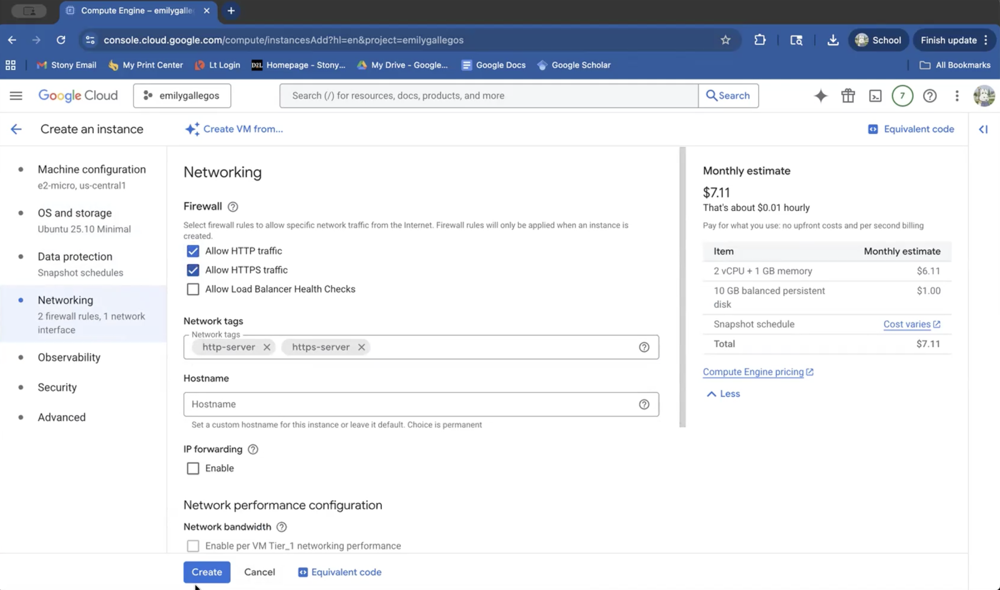
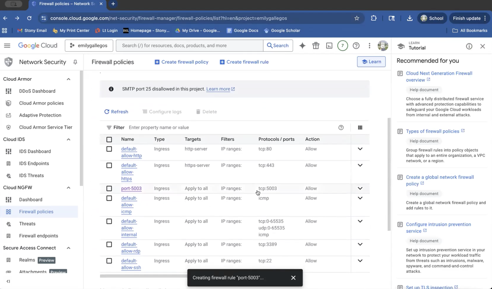
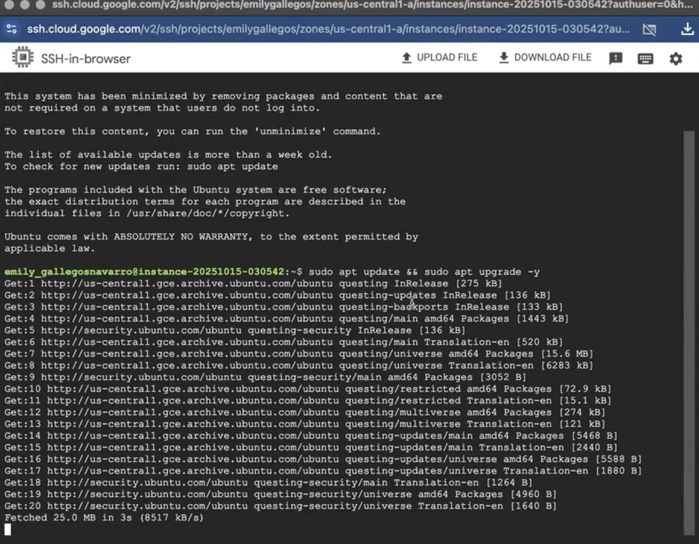
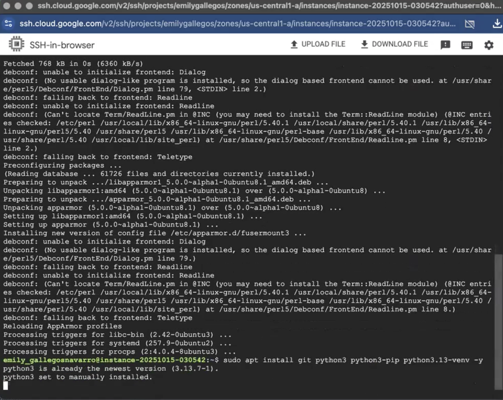
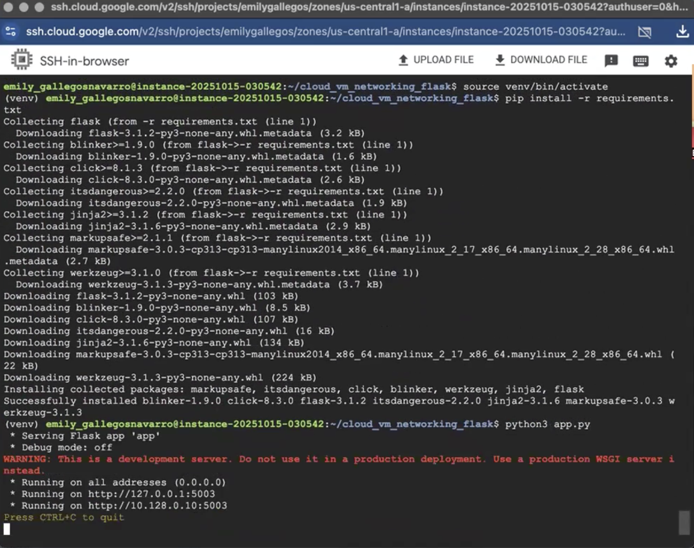
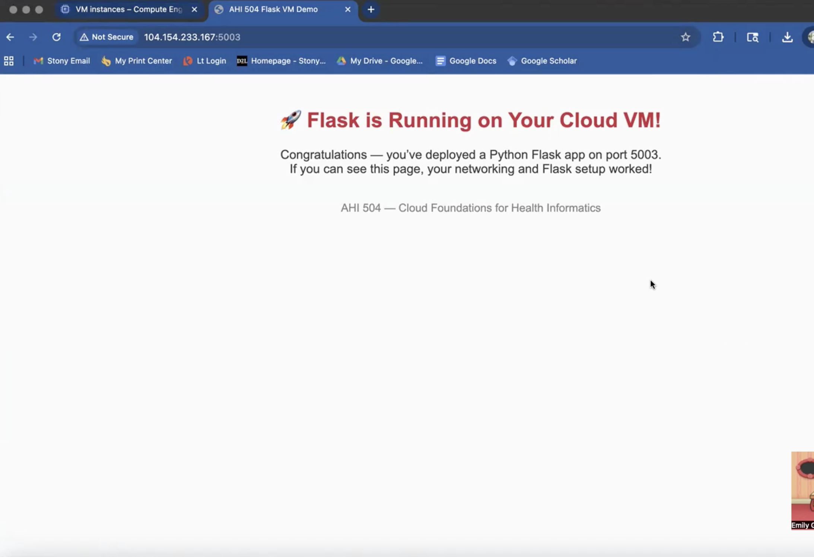
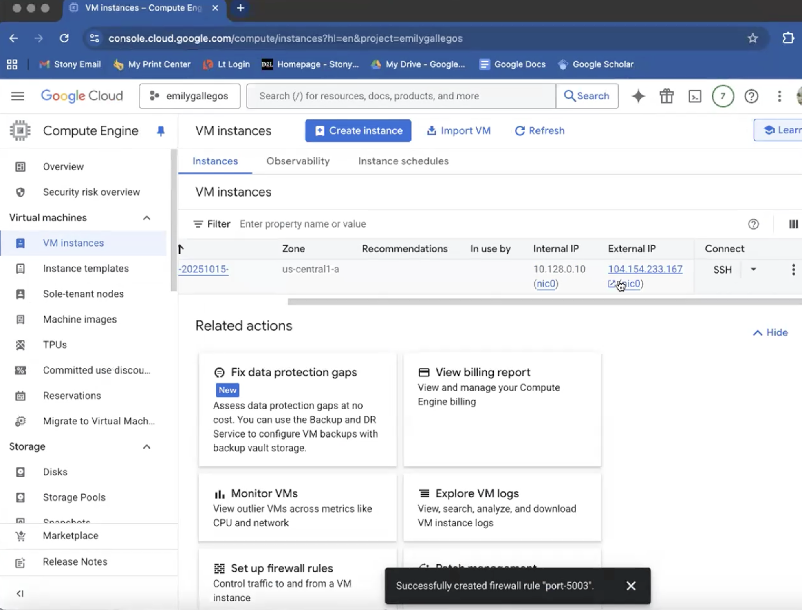

# Flask on Cloud VM (Assignment 2)

## Student Info
- Name: Emily Gallegos
- Cloud Provider: GCP

## Video recording: 
- Zoom/Loom: 

## Steps
### 1. VM Creation

### 2. Networking (Port 5003 Open)
the networking 

### 3. OS Update + Python Install
'sudo apt update && sudo apt upgrade -y' was used to update and upgrade the operating system.

'sudo apt install git python3 python3-pip python3.13-venv -y' was used to install python and some other dependencies necessary to properly run the web app

### 4. Flask App Running

### 5. Public IP Access
URL: http://104.154.233.167:5003  

